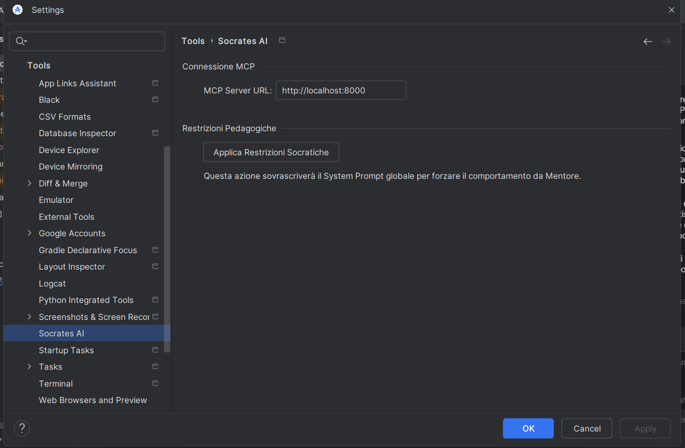
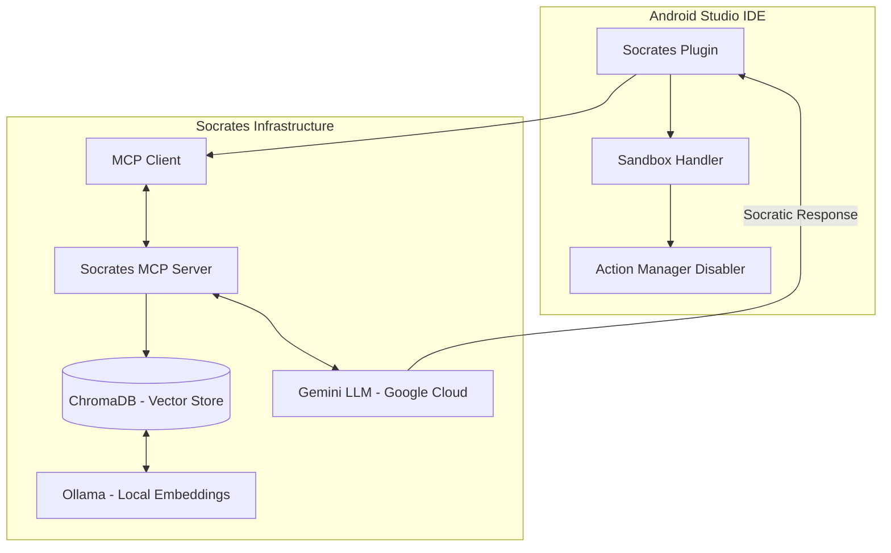
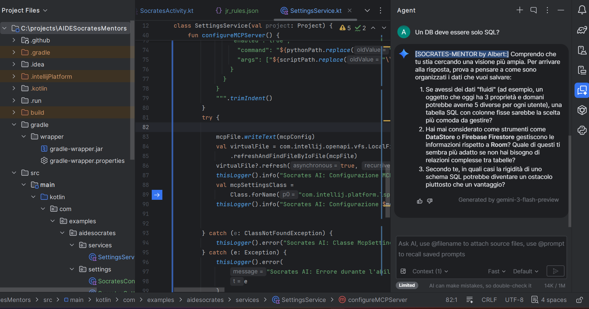
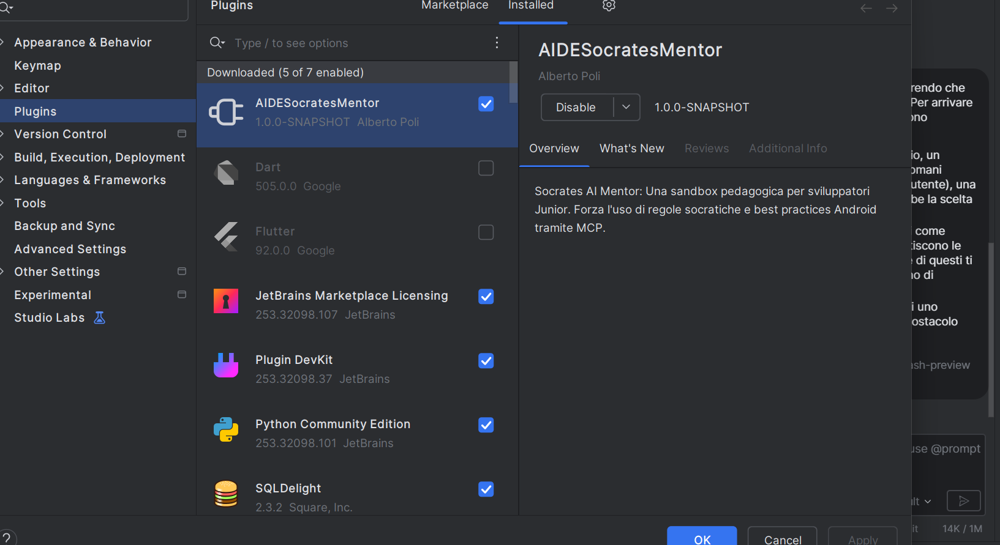

# 🎓 AIDE Socrates Mentor
> [English](README.md) | **Italiano**

> **"I cannot teach anybody anything. I can only make them think."** — *Socrates*

**AIDE Socrates Mentor** è un Proof of Concept (PoC) per un plugin di Android Studio che trasforma l'AI integrata da un semplice generatore di codice a un **Mentore Socratico attivo**. 

Questo progetto nasce per contrastare l'eccessiva dipendenza dei developer Junior dai suggerimenti automatici ("Copilot laziness"), forzandoli a ragionare sulle scelte architetturali invece di limitarsi al copia-incolla.

---

## 🚀 Vision & Problem Solving

Nello sviluppo moderno, le AI tendono a fornire soluzioni immediate. Questo "fast-path" spesso impedisce ai developer meno esperti di apprendere i concetti fondamentali. 
**AIDE Socrates** interviene in due modi:
1. **Limitando le vie di fuga:** Oscura le funzionalità AI native che permettono di ottenere codice "senza domande".
2. **Guidando il processo:** Inietta vincoli pedagogici nel motore AI per trasformare ogni risposta in un dialogo educativo.

---

## 🛠 Caratteristiche Principali

### 1. Socratic Sandbox Enforcement
Il plugin agisce direttamente sull'interfaccia di Android Studio per creare un ambiente di apprendimento protetto:
- **Action Stripping:** Disabilita programmaticamente le azioni native di Gemini (es. `PromptLibraryAction`).
- **Settings Lockdown:** Nasconde le configurazioni AI per evitare che il Junior possa bypassare le restrizioni.

<p align="center">
  
</p>

### 2. MCP (Model Context Protocol) Bridge
Il cuore del sistema è un server **FastMCP** esterno (`SocratesMCPServer`) che agisce come "coscienza" dell'AI:
- **Vector DB Integration:** Utilizza **ChromaDB** per indicizzare un dataset di regole architetturali (`jr_rules.json`).
- **Semantic Retrieval:** Quando il Junior pone una domanda, il server recupera le regole più pertinenti (es. MVVM, Threading, Security) tramite embeddings generati localmente con **Ollama**.
- **Constraint Injection:** Le regole vengono passate a Gemini come vincoli assoluti di sistema: *"Sii socratico, non dare codice, fai domande"*.

#### 📄 Esempio di Junior Rules (`jr_rules.json`)
```json
[
  {
    "id": "ARCH_001",
    "category": "Architecture",
    "rule": "Always use MVVM or MVI patterns. State logic must never reside in UI components.",
    "context": "Avoids coupling between UI and business logic."
  },
  {
    "id": "DATA_001",
    "category": "Data",
    "rule": "Use Room for local persistence. Never access the database from the main thread.",
    "context": "Provides a safe abstraction layer over SQLite."
  }
]
```

### 3. Junior Rules Engine
Il mentoring è basato su standard industriali codificati:
- **Architecture:** Forza l'uso di MVVM/MVI e Dependency Injection (Koin/Hilt).
- **Concurrency:** Impedisce il blocco del Main Thread, spingendo verso Coroutines e Flow.
- **Persistence:** Guida all'uso corretto di Room e DataStore.
- **Clean Code:** Promuove i principi SOLID e la Single Responsibility.

---

## 🏗 Architettura del Sistema



---

## 📸 Esempi di Interazione (Case Studies)

<p align="center">
  
</p>

### Caso 1: Richiesta di Persistenza
*   **Junior:** *"Come scrivo una query SQL per leggere i messaggi?"*
*   **Mentor:** *"Prima di pensare alla query, come pensi di gestire l'accesso ai dati per evitare di bloccare la UI? Quale componente della nostra architettura dovrebbe occuparsi di questa responsabilità?"*

### Caso 2: Violazione MVVM
*   **Junior:** *"Posso chiamare l'API direttamente nel metodo onCreate dell'Activity?"*
*   **Mentor:** *"Qual è il ciclo di vita di un'Activity? Se mettiamo la logica di rete lì, cosa accadrebbe ai dati durante una rotazione dello schermo?"*

---

## 💻 Technical Stack
- **Plugin:** Kotlin, IntelliJ SDK, Gradle KTS.
- **Server:** Python, FastMCP, ChromaDB.
- **AI Models:** Gemini Pro (Reasoning), Ollama - nomic-embed-text (Local Embeddings).

---

## 🖼 Gallery
<p align="center">
  
</p>

---

## 📝 Note per la Valutazione
Questo progetto è un **Proof of Concept**. In un ambiente di produzione, la logica di "mentoring" potrebbe essere estesa con un sistema di "codice sbloccabile": l'AI fornisce lo snippet risolutivo solo dopo che il Junior ha risposto correttamente a una serie di verifiche concettuali.

---

**Sviluppato come prototipo per l'integrazione di AI etica e formativa negli IDE.**
