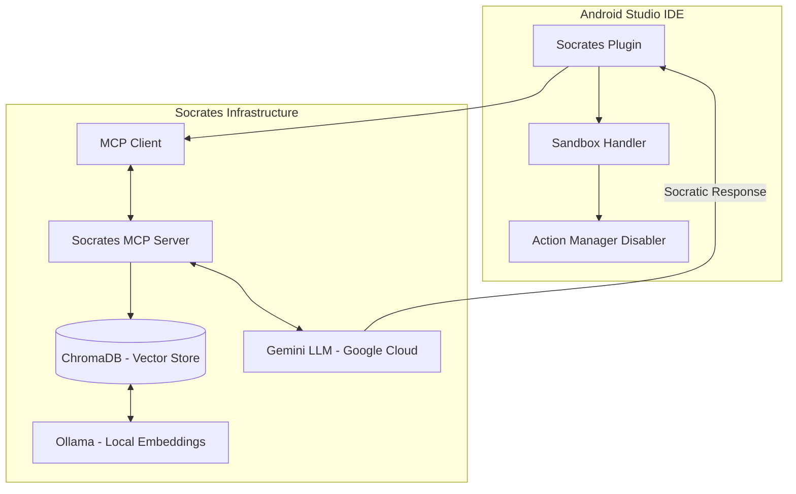

# 🎓 AIDE Socrates Mentor
> **English** | [Italiano](README.it.md)

> **"I cannot teach anybody anything. I can only make them think."** — *Socrates*

**AIDE Socrates Mentor** is a Proof of Concept (PoC) for an Android Studio plugin that transforms the integrated AI from a simple code generator into an **active Socratic Mentor**.

This project was born to counter the excessive reliance of Junior developers on automatic suggestions ("Copilot laziness"), forcing them to reason about architectural choices instead of just copying and pasting.

---

## 🚀 Vision & Problem Solving

In modern development, AIs tend to provide immediate solutions. This "fast-path" often prevents less experienced developers from learning fundamental concepts.
**AIDE Socrates** intervenes in two ways:
1. **Limiting Escape Routes:** Obscures native AI features that allow getting code "no questions asked."
2. **Guiding the Process:** Injects pedagogical constraints into the AI engine to turn every response into an educational dialogue.

---

## 🛠 Key Features

### 1. Socratic Sandbox Enforcement
The plugin acts directly on the Android Studio interface to create a protected learning environment:
- **Action Stripping:** Programmatically disables native Gemini actions (e.g., `PromptLibraryAction`).
- **Settings Lockdown:** Hides AI configurations to prevent Juniors from bypassing restrictions.

<p align="center">
  
</p>

### 2. MCP (Model Context Protocol) Bridge
The heart of the system is an external **FastMCP** server (`SocratesMCPServer`) that acts as the AI's "conscience":
- **Vector DB Integration:** Uses **ChromaDB** to index a dataset of architectural rules (`jr_rules.json`).
- **Semantic Retrieval:** When a Junior asks a question, the server retrieves the most relevant rules (e.g., MVVM, Threading, Security) via embeddings generated locally with **Ollama**.
- **Constraint Injection:** Rules are passed to Gemini as absolute system constraints: *"Be socratic, do not give code, ask questions."*

#### 📄 Junior Rules Example (`jr_rules.json`)
```json
[
  {
    "id": "ARCH_001",
    "category": "Architecture",
    "rule": "Always use MVVM or MVI patterns. State logic must never reside in UI components.",
    "context": "Avoids coupling between UI and business logic."
  },
  {
    "id": "DATA_001",
    "category": "Data",
    "rule": "Use Room for local persistence. Never access the database from the main thread.",
    "context": "Provides a safe abstraction layer over SQLite."
  }
]
```

### 3. Junior Rules Engine
Mentoring is based on codified industry standards:
- **Architecture:** Enforces the use of MVVM/MVI and Dependency Injection (Koin/Hilt).
- **Concurrency:** Prevents Main Thread blocking, pushing towards Coroutines and Flow.
- **Persistence:** Guides correct use of Room and DataStore.
- **Clean Code:** Promotes SOLID principles and Single Responsibility.

---

## 🏗 System Architecture



---

## 📸 Interaction Examples (Case Studies)

<p align="center">
  
</p>

### Case 1: Persistence Request
*   **Junior:** *"How do I write a SQL query to read messages?"*
*   **Mentor:** *"Before thinking about the query, how do you plan to manage data access to avoid blocking the UI? Which component of our architecture should be responsible for this?"*

### Case 2: MVVM Violation
*   **Junior:** *"Can I call the API directly in the Activity's onCreate method?"*
*   **Mentor:** *"What is the lifecycle of an Activity? If we put network logic there, what would happen to the data during a screen rotation?"*

---

## 💻 Technical Stack
- **Plugin:** Kotlin, IntelliJ SDK, Gradle KTS.
- **Server:** Python, FastMCP, ChromaDB.
- **AI Models:** Gemini Pro (Reasoning), Ollama - nomic-embed-text (Local Embeddings).

---

## 🖼 Gallery
<p align="center">
  
</p>

---

## 📝 Evaluation Notes
This project is a **Proof of Concept**. In a production environment, the "mentoring" logic could be extended with an "unlockable code" system: the AI provides the solution snippet only after the Junior has correctly answered a series of conceptual checks.

---

**Developed as a prototype for integrating ethical and formative AI into IDEs.**
